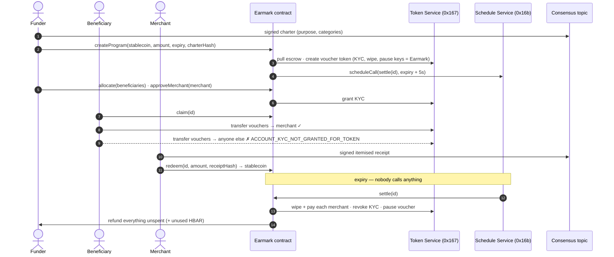

# Earmark — purpose-bound money on Hedera

**Money that knows what it is for.** A funder escrows a stablecoin and gets program-specific vouchers that:

- **can only reach approved people** — every voucher transfer is checked by the Hedera Token Service, not by this app;
- **settle themselves** — at expiry the contract's own scheduled call pays merchants, voids leftovers and refunds the
  funder, with no keeper, cron job or admin;
- **leave an itemised trail** — charters and merchant receipts are signed by wallets and anchored on the Hedera
  Consensus Service, and their hashes are recorded with each redemption.

Use it for humanitarian cash assistance, grants, scholarships, per-diems, subsidies, gift cards or loyalty credit —
anywhere money is given for a purpose and should come back if it is not used for it. It is the
[Purpose Bound Money](https://www.mas.gov.sg/schemes-and-initiatives/project-orchid) pattern, built from Hedera
native services instead of application logic.

```bash
npm create scaffold-hbar@latest -- --template successaje/earmark
```

---

## Contents

- [What happens, end to end](#what-happens-end-to-end)
- [Why each Hedera service is load-bearing](#why-each-hedera-service-is-load-bearing)
- [Quickstart (5 minutes)](#quickstart-5-minutes)
- [Watch a full lifecycle from the CLI](#watch-a-full-lifecycle-from-the-cli)
- [Deploy your own](#deploy-your-own)
- [Environment variables](#environment-variables)
- [Architecture](#architecture)
- [Hedera behaviours this template handles](#hedera-behaviours-this-template-handles)
- [Testing](#testing)
- [Trust model and limits](#trust-model-and-limits)
- [Verified on testnet](#verified-on-testnet)
- [Extending it](#extending-it)

---

## What happens, end to end



1. **Charter.** The funder writes what the money is for. The browser has their wallet sign it; the server anchors it on
   HCS. Its keccak256 hash is passed into `createProgram`, so the on-chain program and the public charter are bound.
2. **Escrow and voucher.** `createProgram` pulls the stablecoin (any HTS fungible token, e.g. USDC) and creates a new
   HTS token minted 1:1 against it. The Earmark contract is the treasury and holds the voucher's KYC, wipe and pause
   keys. There is no supply key, so nobody — including Earmark — can ever mint more vouchers than are escrowed.
3. **Self-scheduled settlement.** In the same transaction the contract calls the Hedera Schedule Service to run
   `settle(id)` shortly after expiry, and pays for it from the HBAR sent with the call.
4. **Enrolment.** The funder allocates amounts to beneficiaries and approves merchants (with a category). Each
   account first opts in to the voucher with HIP-719 `associate()`; Earmark then grants it KYC.
5. **Spending.** Beneficiaries pay merchants with a plain token transfer from any wallet. A transfer to any account
   without KYC is rejected by the network.
6. **Redemption.** A merchant signs an itemised receipt, anchors it on HCS, and calls `redeem` with its hash. Earmark
   wipes the vouchers and pays the same amount of stablecoin.
7. **Settlement.** At expiry the network executes the schedule. Earmark pays each merchant for any vouchers still
   held, revokes their KYC, pauses the voucher so leftovers are void, and returns the rest of the escrow and unused
   HBAR to the funder. With more than eight merchants it settles in batches, scheduling each next batch itself.

## Why each Hedera service is load-bearing

| Service | What Earmark uses | What breaks without it |
| --- | --- | --- |
| **Token Service** | Contract-created token; KYC key as the closed-loop allowlist; wipe on redemption; pause at close; HIP-719 association; HIP-218 ERC-20 facade; `transferFrom` for escrow | Vouchers could be sent anywhere. Purpose enforcement would be app code that any wallet bypasses. |
| **Schedule Service** (HIP-1215) | `scheduleCall` at creation, `deleteSchedule` + reschedule on extension, self-continuation for batched settlement, `hasScheduleCapacity` probing | Nothing would ever close a program. Funds would sit until someone runs a keeper, and the funder could not get unspent money back without trusting one. |
| **Consensus Service** | Public topic of wallet-signed charters and itemised receipts, hash-linked to `ProgramCreated` and `Redeemed` events | Donors would see that a merchant was paid, but not for what. Receipts would live in someone's database. |
| **Mirror node** | Association/KYC status, schedule execution, topic messages, contract logs | The dashboard could not show who can receive vouchers or prove that the network ran settlement. |

Remove any one and the product stops being purpose-bound money: it becomes either a transferable token, a vault that
needs an operator, or a ledger without receipts.

## Quickstart (5 minutes)

The template ships pointed at a live testnet deployment, so you can use it before deploying anything.

**Prerequisites:** Node.js ≥ 20.18.3, Yarn (via `corepack enable`), Git, [Foundry](https://getfoundry.sh) (for
contracts), and MetaMask or another EVM wallet.

```bash
npm create scaffold-hbar@latest -- --template successaje/earmark
cd <your-project>
yarn start
```

Open <http://localhost:3000>.

1. **Get testnet HBAR.** Create an ECDSA account at [portal.hedera.com](https://portal.hedera.com) and import its key
   into MetaMask, or send testnet HBAR to any MetaMask address (the network creates the account). The app's
   "Get testnet HBAR" button opens the faucet.
2. **Connect** on *Hedera Testnet* (chain id 296, RPC `https://testnet.hashio.io/api`). The connect button offers to
   add the network.
3. **Fund a program.** On *Fund a program*, press *Get 1,000 dUSD* (the testnet stand-in for USDC), set a 10-minute
   window and create. You sign the charter, approve the escrow and confirm `createProgram`.
4. **Play the other roles.** Open the program page from a second and third wallet (or browser profile): each one
   presses *Associate* in the *Join* card. Back as the funder, allocate to the first and approve the second as a
   merchant. The beneficiary claims and pays; the merchant builds a receipt and redeems.
5. **Wait.** When the window closes, watch *Self-settlement* flip to *Executed by the network* and the program close.

HCS anchoring needs a server-side operator account (see [environment variables](#environment-variables)). Without
one, everything else works and the hashes still go on-chain; the UI says anchoring is off.

## Watch a full lifecycle from the CLI

One command plays every role on testnet with fresh accounts and prints a HashScan link for each step, including the
transfer the network rejects and the settlement nobody triggered.

```bash
cp packages/nextjs/.env.example packages/nextjs/.env.local
# fill in HEDERA_OPERATOR_ID and HEDERA_OPERATOR_KEY (an ECDSA testnet account with ~100 HBAR)
yarn earmark:demo
```

```text
4 · The network, not the app, enforces the purpose
  ✓ An outsider associates with the voucher (no KYC)
  ✗ rejected Beneficiary tries to send 5 vouchers to the outsider
      reason: ACCOUNT_KYC_NOT_GRANTED_FOR_TOKEN: The recipient is not part of this program, so the network refuses the transfer.
  ✓ Beneficiary pays the merchant 30 vouchers
5 · Merchant anchors an itemised receipt and redeems 20
  ✓ Receipt anchored as message #2 (20 dUSD)
  ✓ Redeem 20 vouchers for dUSD, citing the receipt hash
6 · Hands off. Waiting for the network to run the scheduled settlement…
  ✓ Schedule 0.0.10829003 executed at 2026-10-02T17:52:29.053Z
  ✓ Merchant holds 30 dUSD (20 redeemed by hand + 10 settled automatically)
  ✓ Funder refunded 70 dUSD (unallocated + unspent)
  ✓ Voucher token is PAUSED: the beneficiary's 20 unspent vouchers are void
```

It takes about six minutes, most of it waiting for expiry.

## Deploy your own

Earmark calls Hedera system contracts, so it must run on Hedera testnet or mainnet. A plain local Anvil chain has no
`0x167` or `0x16b`.

```bash
# 1. A Foundry keystore for a funded ECDSA account (paste the hex private key from the portal)
yarn foundry:account:import

# 2. Deploy Earmark and DemoDollar; ABIs and addresses land in packages/nextjs/contracts/deployedContracts.ts
yarn foundry:deploy --network hedera_testnet --keystore <name>

# 3. Create the dUSD token and your own HCS topic (writes NEXT_PUBLIC_EARMARK_TOPIC_ID to .env.local)
yarn earmark:setup

# 4. Run it
yarn start
```

Contract creation is split from setup because Forge simulates scripts on a local EVM before broadcasting, and that
EVM has no Hedera system contracts. Deployment only deploys bytecode; `earmark:setup` performs the HTS and HCS work
against the real network.

To back programs with real USDC, enter Circle's token in *Advanced → Backing token* on the create page
(`0.0.429274` on testnet, `0.0.456858` on mainnet). DemoDollar is never referenced by Earmark itself.

## Environment variables

`packages/nextjs/.env.local` (copy from `packages/nextjs/.env.example`; it is git-ignored):

| Variable | Needed for | Notes |
| --- | --- | --- |
| `HEDERA_OPERATOR_ID` | HCS anchoring, `earmark:*` scripts | Account id, e.g. `0.0.1234`. Server-side only. |
| `HEDERA_OPERATOR_KEY` | HCS anchoring, `earmark:*` scripts | ECDSA private key (hex). Never prefixed `NEXT_PUBLIC_`, never sent to the browser. |
| `HEDERA_NETWORK` | scripts | `testnet` (default) or `mainnet`. |
| `NEXT_PUBLIC_EARMARK_TOPIC_ID` | reading/anchoring | Written by `earmark:setup`. Defaults to the shared testnet topic. |
| `NEXT_PUBLIC_HEDERA_TESTNET_RPC_URL` | optional | Defaults to Hashio. |
| `NEXT_PUBLIC_HEDERA_TESTNET_MIRROR_URL` | optional | Defaults to the public testnet mirror node. |
| `NEXT_PUBLIC_WALLET_CONNECT_PROJECT_ID` | optional | For WalletConnect wallets. |

`packages/foundry/.env` holds the deployer keystore name (filled in by `foundry:account:*`).

## Architecture

```text
packages/
├── foundry/
│   ├── contracts/
│   │   ├── Earmark.sol              # the primitive: escrow, voucher, enrolment, redemption, settlement
│   │   ├── DemoDollar.sol           # testnet faucet token (stand-in for USDC)
│   │   └── hedera/                  # minimal HTS + HSS interfaces and response codes
│   ├── script/Deploy.s.sol          # deploys bytecode only (see "Deploy your own")
│   └── test/
│       ├── Earmark.t.sol            # 49 unit and fuzz tests
│       ├── EarmarkInvariant.t.sol   # handler-based invariants: supply == escrow, backing conserved
│       └── mocks/                   # HTS and HSS emulators with real response codes
└── nextjs/
    ├── app/
    │   ├── page.tsx                 # landing + program list
    │   ├── programs/new/            # charter → approve → createProgram
    │   ├── programs/[id]/           # dashboard: settlement, role panels, receipts, activity
    │   └── api/hcs/route.ts         # verifies signatures, then anchors on HCS
    ├── hooks/earmark/               # program state, mirror-node queries, HTS-aware writes
    ├── services/earmark/hcs.ts      # Hiero SDK client (server and scripts only)
    ├── utils/earmark/
    │   ├── messages.ts              # charter/receipt schemas, canonical JSON, hashing
    │   ├── mirror.ts                # token relationships, schedules, topic messages, logs
    │   ├── network.ts               # entity ids ↔ long-zero addresses, HashScan links
    │   ├── abis.ts                  # HTS token facade ABI and explicit gas limits
    │   └── responseCodes.ts         # human-readable Hedera response codes
    └── scripts/                     # earmark:setup and earmark:demo
```

### Contract

`Earmark` is a single, ownerless contract hosting any number of programs. Each program is a state machine:

```text
Active ──(expiry; network calls settle)──► Settling ──(last merchant batch)──► Closed
```

| Function | Caller | Effect |
| --- | --- | --- |
| `createProgram(params)` payable | funder | escrow, create voucher, schedule settlement |
| `allocate(id, who[], amount[])` / `deallocate` | funder | reserve vouchers for beneficiaries |
| `approveMerchant(id, merchant, category)` | funder | grant KYC to a merchant |
| `removeMerchant(id, merchant)` | funder | pay out, then revoke KYC |
| `extendExpiry(id, newExpiry)` | funder | delete schedule, schedule later (never earlier) |
| `claim(id)` | beneficiary | grant KYC, receive allocation |
| `redeem(id, amount, receiptHash)` | merchant | wipe vouchers, receive stablecoin |
| `settle(id)` | the network (or anyone after expiry) | settle a batch of merchants; close when done |
| `withdrawOwed(id)` | anyone owed | collect a payout the network rejected during settlement |
| `withdrawHbar()` | funder | collect an HBAR refund the funder's account rejected at close |

Invariants: while a program is open, the voucher's total supply equals `escrowOf(id)`, and every unit of backing that
ever entered is either still escrowed, paid to a merchant or refunded. Vouchers are wiped before any stablecoin leaves,
and there is no supply key. `EarmarkInvariant.t.sol` checks both after every step of 256 random runs of claims,
payments, redemptions and settlement.

Backing must be a fee-free HTS fungible token. `createProgram` rejects tokens with custom fees (they would skim the
escrow or bill the pool shared by every program) and other programs' vouchers (which get paused at close).

### Off-chain documents

Charters and receipts (`utils/earmark/messages.ts`) are JSON documents validated with zod, serialised canonically
(keys sorted) and hashed with keccak256. The author's wallet signs the hash (EIP-191). `POST /api/hcs` re-verifies the
signature and, for receipts, that the signer is an approved merchant; it anchors each document once and rate-limits
each client (in-process state — use a shared store behind multiple instances), then submits the message. The topic has no
submit key: authorship comes from the signatures, so anyone can verify messages without trusting the server, and the
server pays the fee without holding the authority. Messages are capped at 1,024 bytes so each one is a single HCS
chunk.

The dashboard re-checks every receipt in the browser: the signature must recover the named merchant, and a `Redeemed`
event must carry the receipt's hash from that same merchant for exactly its total.

## Hedera behaviours this template handles

These are worth knowing before you build anything on HTS and HSS:

- **`block.timestamp` trails consensus time.** It is the start of the ~2 s record block, so a schedule executing at
  second *T* can read `block.timestamp == T - 1`. Earmark schedules settlement `SETTLEMENT_DELAY` (5 s) after expiry.
  (The first testnet run reverted with `NotExpired()` for exactly this reason.)
- **`msg.sender` in a scheduled call is the payer of the transaction that created the schedule**, not the scheduling
  contract. `settle` therefore uses no sender-based access control.
- **The scheduling contract pays.** HSS charges execution to the contract's HBAR balance. Earmark measures what each
  program has left after token creation and refunds exactly that program's share at close.
- **Schedules expire after 62 days.** `MAX_DURATION` is 60 days; `extendExpiry` replaces the schedule.
- **HTS costs show up as gas.** Auto-association and token operations are priced into gas, so plain EVM gas estimates
  fail with `INSUFFICIENT_GAS`. `utils/earmark/abis.ts` sets explicit limits.
- **Association before KYC.** KYC can only be granted to an associated account. Accounts associate themselves via
  HIP-719 `associate()` on the token address — a contract cannot do it for them.
- **Contract-created tokens refund unused creation fees** to the creating contract, which is how the reserve is
  measured.
- **One stuck account must not jam settlement.** A merchant can dissociate from the stablecoin or the voucher, and a
  funder can be a contract that rejects HBAR. Settlement never reverts on any of it: rejected payouts are parked in
  `owed`, rejected HBAR refunds in `hbarOwed`, a merchant whose wipe fails is skipped, KYC revocation is best-effort,
  and HBAR is sent without copying return data. The treasury (the contract itself) can never be approved as a
  merchant, because HTS refuses to wipe a treasury.

## Testing

```bash
yarn test            # forge test: 49 unit/fuzz tests + 2 invariants against HTS/HSS emulators
yarn lint            # forge fmt --check + ESLint/Prettier
yarn next:check-types
yarn next:build
yarn earmark:demo    # the integration test: the real network, end to end
```

The mocks (`packages/foundry/test/mocks`) are etched at `0x167` and `0x16b` and reproduce the behaviour Earmark
relies on with the network's real response codes: KYC checked on both sides of a transfer, pause blocking every
operation, wipe refusing the treasury, association required for KYC, allowances for `transferFrom`, and creation fees
refunded to the caller, custom-fee schedules, HIP-719 dissociation, and schedule creation that fails or runs out of
capacity. Tests fire schedules the way the network does — at their second, sent by a relay payer rather than the
contract — so batching, rescheduling, capacity exhaustion and late settlement are all exercised. CI runs all of the above except the demo.

## Trust model and limits

- **The funder can:** allocate and deallocate unclaimed vouchers, approve and remove merchants (removal pays the
  merchant first), and extend the expiry.
- **The funder cannot:** shorten the expiry, mint vouchers, take vouchers back from beneficiaries, touch the escrow
  before settlement, or block settlement (by approving odd merchants, rejecting refunds or anything else).
- **Earmark has no owner or upgrade path.** Settlement can be triggered by anyone after expiry, so a failed or
  capacity-starved schedule never strands funds.
- **Beneficiaries can transfer vouchers to each other** (both hold KYC). For strict non-transferability, route
  spending through the contract instead of direct transfers.
- Programs support up to 64 merchants, settled 8 per scheduled call.
- This is unaudited template code. Review it before using real money.

## Verified on testnet

Shared deployment used by the template (Hedera testnet):

| What | Id |
| --- | --- |
| Earmark contract | [`0.0.10828902`](https://hashscan.io/testnet/contract/0.0.10828902) |
| DemoDollar faucet | [`0.0.10828905`](https://hashscan.io/testnet/contract/0.0.10828905) · token [`0.0.10828987`](https://hashscan.io/testnet/token/0.0.10828987) |
| HCS topic | [`0.0.10828988`](https://hashscan.io/testnet/topic/0.0.10828988) |

A complete `yarn earmark:demo` run (program #1):

| Step | Proof |
| --- | --- |
| `createProgram`: escrow + voucher creation + scheduling | [tx](https://hashscan.io/testnet/transaction/1790963396.413315017) · voucher [`0.0.10829002`](https://hashscan.io/testnet/token/0.0.10829002) · schedule [`0.0.10829003`](https://hashscan.io/testnet/schedule/0.0.10829003) |
| Beneficiary claims (KYC grant + transfer) | [tx](https://hashscan.io/testnet/transaction/1790963435.016033426) |
| Merchant approved (KYC grant) | [tx](https://hashscan.io/testnet/transaction/1790963452.631873104) |
| Transfer to a non-enrolled account, **rejected by the network** | [tx](https://hashscan.io/testnet/transaction/1790963472.313307104) |
| Beneficiary pays merchant | [tx](https://hashscan.io/testnet/transaction/1790963486.531940564) |
| Redemption citing an HCS receipt | [tx](https://hashscan.io/testnet/transaction/1790963496.791871104) · [topic](https://hashscan.io/testnet/topic/0.0.10828988) |
| **Settlement executed by the network**, paid by the contract | [tx](https://hashscan.io/testnet/transaction/1790963549.053363702) |

## Extending it

- **Per-category budgets:** route spending through the contract and cap each beneficiary per merchant category.
- **Merkle allocations:** replace `allocate` with a root and let beneficiaries claim with proofs, for millions of
  recipients.
- **Paid receipt topics:** use HIP-991 custom fees so merchants fund their own HCS messages.
- **Recurring programs:** have `settle` schedule the next period's program instead of closing.
- **Identity:** gate `claim` on a verifiable credential instead of a funder-written allocation.

## License

[MIT](LICENCE)
