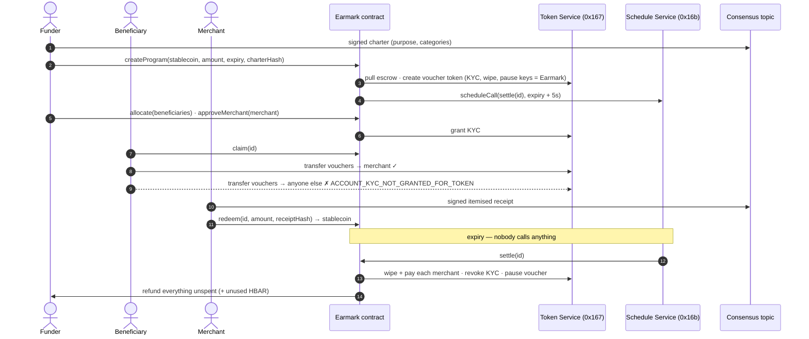

# Earmark

**Money that knows what it is for.** A Scaffold-HBAR template for *policy-bound money*: budgets that carry their own
rules about who can receive them, where they can be spent, what proves they were spent well, and what happens when
time runs out.

```bash
npm create scaffold-hbar@latest -- --template successaje/earmark
cd <your-project> && yarn start
```

```text
      100 USDC ──► escrowed by Earmark ──► 100 eFOOD minted (HTS, no supply key)
                                              │
                                     Alice receives 50
                                       │            │
                                       ▼            ▼
                              Grocer ✓ (approved)   Any other wallet ✕
                                                    rejected by Hedera:
                                                    ACCOUNT_KYC_NOT_GRANTED_FOR_TOKEN
      expiry ──► Hedera runs the settlement the contract scheduled itself:
                 merchants paid · leftovers voided · unspent USDC back to the funder
```

What you get:

- **Restricted destinations, enforced by the network.** The program credit is an HTS token whose KYC key belongs to
  the contract. A wallet, a bot or a modified frontend cannot send it anywhere unapproved —
  [here is Hedera refusing](https://hashscan.io/testnet/transaction/1791029115.235616669).
- **Autonomous settlement.** The contract schedules its own close with the Hedera Schedule Service (HIP-1215). No
  keeper, cron job or admin — [here is the network running it](https://hashscan.io/testnet/transaction/1791029364.055681104).
- **Proof of spend.** Funders' charters and merchants' itemised receipts are wallet-signed, anchored on the Hedera
  Consensus Service, and hash-linked to each redemption.
- **Fund with HBAR.** No stablecoin? `createProgramWithHbar` swaps HBAR through **SaucerSwap** inside the same
  transaction and escrows exactly what the swap delivered, guarded by the funder's slippage floor.
- **A full working app and a one-command demo:** `yarn earmark:demo` plays every role on testnet and prints a
  HashScan link for each step.

Use it for grants, humanitarian cash assistance, scholarships, employee allowances, subsidies, event or gift credit —
anywhere money is given for a purpose and should come back if it is not used for it. It implements the
[Purpose Bound Money](https://www.mas.gov.sg/schemes-and-initiatives/project-orchid) pattern from Hedera native
services instead of application logic.

---

## Contents

- [Why not an ERC-20 with an allowlist?](#why-not-an-erc-20-with-an-allowlist)
- [The four policies](#the-four-policies)
- [What happens, end to end](#what-happens-end-to-end)
- [Why each Hedera service is load-bearing](#why-each-hedera-service-is-load-bearing)
- [Quickstart (5 minutes)](#quickstart-5-minutes)
- [Watch a full lifecycle from the CLI](#watch-a-full-lifecycle-from-the-cli)
- [Deploy your own](#deploy-your-own)
- [Environment variables](#environment-variables)
- [Architecture](#architecture)
- [Hedera behaviours this template handles](#hedera-behaviours-this-template-handles)
- [What building from Earmark teaches you](#what-building-from-earmark-teaches-you)
- [Testing](#testing)
- [Trust model, privacy and limits](#trust-model-privacy-and-limits)
- [Verified on testnet](#verified-on-testnet)
- [Extending it](#extending-it)

---

## Why not an ERC-20 with an allowlist?

Because then the rules live in code that the money can route around.

```text
Solidity allowlist                         Earmark
──────────────────                         ───────
wallet ─► token contract checks            wallet ─► HTS transfer
          its own mapping                            │
          (upgradeable, forkable,                    ▼
           bypassed by any wrapper,          network checks KYC on sender
           only as good as the code)         AND recipient for this token
                                                     │
                                                     ▼
                                            unapproved recipient rejected
                                            by every node, from any wallet
```

Earmark keeps three promises that a plain token cannot:

| Promise | How |
| --- | --- |
| It only reaches approved accounts | HTS KYC, with the KYC key held by the Earmark contract |
| It is always fully backed | No supply key on the credit; vouchers are wiped before backing leaves; checked by invariant tests and shown live on every program page |
| It ends on time without anyone acting | A Hedera schedule created in the same transaction as the program |

## The four policies

Every Earmark program answers four questions. The template ships one reference answer to each, and each is a seam
you can replace:

| Policy | Question | Reference implementation | Where it lives | Natural extensions |
| --- | --- | --- | --- | --- |
| **Eligibility** | *Who* can receive it? | The funder allocates amounts to accounts; recipients claim | `allocate`, `claim` | Merkle allocations, verifiable credentials, NFT or DAO membership |
| **Spending** | *Where* can it go? | Approved merchants hold HTS KYC on the credit; the network enforces it | `approveMerchant`, `removeMerchant` | Category budgets routed through the contract, merchant registries, credential-gated merchants |
| **Evidence** | *What* proves good use? | Wallet-signed itemised receipts on HCS, hash bound to `redeem` | `utils/earmark/messages.ts`, `api/hcs` | Attachments on content-addressed storage (CID anchored on HCS), recipient co-signatures, encrypted line items |
| **Settlement** | *Until when*, and then what? | HSS closes it at expiry: pay merchants, void leftovers, refund the funder | `settle`, `_close` | Roll over into the next period, redistribute, transfer to a successor program |

Funding is a fifth, smaller seam: `createProgram` escrows a stablecoin the funder already holds, and
`createProgramWithHbar` buys it with HBAR on SaucerSwap first. Both end in the same internal `_open`.

Merchant **categories** are labels today: they describe a merchant to recipients and auditors, while enforcement is
per merchant. Per-category budgets (e.g. Food $60 / Transport $25) need spending routed through the contract,
because a plain token transfer cannot say which budget it draws from — see [Extending it](#extending-it).

## What happens, end to end



1. **Charter.** The funder writes what the money is for. The browser has their wallet sign it; the server anchors it on
   HCS. Its keccak256 hash is passed into `createProgram`, so the on-chain program and the public charter are bound.
2. **Escrow and voucher.** `createProgram` pulls the stablecoin (any HTS fungible token, e.g. USDC) and creates a new
   HTS token minted 1:1 against it. The Earmark contract is the treasury and holds the voucher's KYC, wipe and pause
   keys. There is no supply key, so nobody — including Earmark — can ever mint more vouchers than are escrowed.
3. **Self-scheduled settlement.** In the same transaction the contract calls the Hedera Schedule Service to run
   `settle(id)` shortly after expiry, and pays for it from the HBAR sent with the call.
4. **Enrolment.** The funder allocates amounts to beneficiaries and approves merchants (with a category). Each
   account first opts in to the voucher with HIP-719 `associate()`; Earmark then grants it KYC.
5. **Spending.** Beneficiaries pay merchants with a plain token transfer from any wallet. A transfer to any account
   without KYC is rejected by the network.
6. **Redemption.** A merchant signs an itemised receipt, anchors it on HCS, and calls `redeem` with its hash. Earmark
   wipes the vouchers and pays the same amount of stablecoin.
7. **Settlement.** At expiry the network executes the schedule. Earmark pays each merchant for any vouchers still
   held, revokes their KYC, pauses the voucher so leftovers are void, and returns the rest of the escrow and unused
   HBAR to the funder. With more than eight merchants it settles in batches, scheduling each next batch itself.

## Why each Hedera service is load-bearing

| Service | What Earmark uses | What breaks without it |
| --- | --- | --- |
| **Token Service** | Contract-created token; KYC key as the closed-loop allowlist; wipe on redemption; pause at close; HIP-719 association; HIP-218 ERC-20 facade; `transferFrom` for escrow | Vouchers could be sent anywhere. Purpose enforcement would be app code that any wallet bypasses. |
| **Schedule Service** (HIP-1215) | `scheduleCall` at creation, `deleteSchedule` + reschedule on extension, self-continuation for batched settlement, `hasScheduleCapacity` probing | Nothing would ever close a program. Funds would sit until someone runs a keeper, and the funder could not get unspent money back without trusting one. |
| **Consensus Service** | Public topic of wallet-signed charters and itemised receipts, hash-linked to `ProgramCreated` and `Redeemed` events | Donors would see that a merchant was paid, but not for what. Receipts would live in someone's database. |
| **SaucerSwap** (V1 router) | `createProgramWithHbar` swaps HBAR into the backing stablecoin and escrows the measured output; the create page quotes it live with `getAmountsOut` | A funder must already hold the exact stablecoin, so most HBAR holders cannot fund a program at all. |
| **Mirror node** | Association/KYC status, schedule execution, topic messages, contract logs | The dashboard could not show who can receive vouchers or prove that the network ran settlement. |

Remove any one and the product stops being purpose-bound money: it becomes either a transferable token, a vault that
needs an operator, or a ledger without receipts.

## Quickstart (5 minutes)

The template ships pointed at a live testnet deployment, so you can use it before deploying anything.

**Prerequisites:** Node.js ≥ 20.18.3, Yarn (via `corepack enable`), Git, [Foundry](https://getfoundry.sh) ≥ 1.4 (for
contracts), and MetaMask or another EVM wallet.

The template is Yarn-only on purpose: it ships a `yarn.lock`, and installing without it currently resolves Hedera SDK
and viem releases that do not type-check together. Reproducible installs matter more than a second package manager.

```bash
npm create scaffold-hbar@latest -- --template successaje/earmark
cd <your-project>
yarn start
```

Open <http://localhost:3000>.

1. **Get testnet HBAR.** Create an ECDSA account at [portal.hedera.com](https://portal.hedera.com) and import its key
   into MetaMask, or send testnet HBAR to any MetaMask address (the network creates the account). The app's
   "Get testnet HBAR" button opens the faucet.
2. **Connect** on *Hedera Testnet* (chain id 296, RPC `https://testnet.hashio.io/api`). The connect button offers to
   add the network.
3. **Create a program.** On *Create a program*, pick a template (Food assistance uses a 10-minute window). Either
   press *Get 1,000 dUSD* (the testnet stand-in for USDC), or choose **Fund with → HBAR, swapped on SaucerSwap** and
   enter an HBAR amount: the page shows SaucerSwap's live quote and your slippage floor. Then *Review program* →
   *Create program*. You sign the charter,
   approve the escrow and confirm `createProgram`; the page shows each step as it completes.
4. **Play the other roles from one wallet.** As the funder, use *Play every role from one wallet* on the program page:
   it creates a throwaway recipient and shop in your browser (funded with 10 HBAR each from your wallet) and walks
   through activation, an allowance, a payment Hedera rejects, approval, a real payment and a receipt-backed payout.
   Or play them by hand: Open the program page from a second and third wallet (or browser profile): each one
   presses *Activate wallet* in the *Join* card (HIP-719 association). Back as the funder, *Give allowances* to the
   first and *Approve where it can be spent* for the second. The recipient presses *Activate my funds* and pays; the
   merchant fills in a receipt and presses *Sign receipt & get paid*. Try *Try to break the rules* to watch Hedera
   reject a transfer.
5. **Wait.** When the window closes, watch *Autonomous settlement* flip to *Executed by the network*, the money flow
   show the refund, and *Guarantees* report the credit paused.

Open *Developer view* at the bottom of any program page for every Hedera entity behind it, with HashScan links.

HCS anchoring needs a server-side operator account (see [environment variables](#environment-variables)). Without
one the app runs in *local-only evidence mode*: documents are still signed and their hashes go on-chain, but they are
not published, and the UI says so.

## Watch a full lifecycle from the CLI

One command plays every role on testnet with fresh accounts and prints a HashScan link for each step, including the
transfer the network rejects and the settlement nobody triggered.

```bash
cp packages/nextjs/.env.example packages/nextjs/.env.local
# fill in HEDERA_OPERATOR_ID and HEDERA_OPERATOR_KEY (an ECDSA testnet account with ~100 HBAR)
yarn earmark:demo
```

```text
3 · BREAK THE RULES
The recipient tries to send credit to a wallet outside the program. Expected: Hedera refuses.

  ✓ An outsider associates with the voucher (no KYC)
  ✗ rejected Recipient sends 5 eFOOD to an unapproved wallet — the app did not stop this, the network did
      reason: ACCOUNT_KYC_NOT_GRANTED_FOR_TOKEN: The recipient is not part of this program, so the network refuses the transfer.
  ✓ Recipient pays the grocer 30 eFOOD

4 · SPEND & PROVE
  ✓ Receipt anchored as message #8 (20 dUSD)
  ✓ Redeem 20 vouchers for dUSD, citing the receipt hash

5 · WALK AWAY
No keeper. No cron job. No admin call. Waiting for Hedera to run the settlement the contract scheduled…

6 · SETTLED
Executed automatically by Hedera.
  ✓ Schedule 0.0.10841598 executed at 2026-10-03T12:09:24.055Z
  ✓ Merchant holds 30 dUSD (20 redeemed by hand + 10 settled automatically)
  ✓ Funder refunded 70 dUSD (unallocated + unspent)
  ✓ Voucher token is PAUSED: the beneficiary's 20 unspent vouchers are void
```

It takes about six minutes, most of it waiting for expiry.

## Deploy your own

Earmark calls Hedera system contracts, so it must run on Hedera testnet or mainnet. A plain local Anvil chain has no
`0x167` or `0x16b`.

```bash
# 1. A Foundry keystore for a funded ECDSA account (paste the hex private key from the portal)
yarn foundry:account:import

# 2. Deploy Earmark and DemoDollar; ABIs and addresses land in packages/nextjs/contracts/deployedContracts.ts
yarn foundry:deploy --network hedera_testnet --keystore <name>

# 3. Create the dUSD token and your own HCS topic (writes NEXT_PUBLIC_EARMARK_TOPIC_ID to .env.local)
yarn earmark:setup

# 4. Run it
yarn start
```

`Deploy.s.sol` wires Earmark to SaucerSwap's V1 router and WHBAR token for the network it deploys to (testnet
`0.0.19264` / `0.0.15058`, mainnet `0.0.3045981` / `0.0.1456986`); anywhere else HBAR funding is disabled. The create
page swaps into `swapBackingTokenId` from `utils/earmark/network.ts` (SaucerSwap's testnet USDC `0.0.5449`, Circle
USDC on mainnet).

Contract creation is split from setup because Forge simulates scripts on a local EVM before broadcasting, and that
EVM has no Hedera system contracts. Deployment only deploys bytecode; `earmark:setup` performs the HTS and HCS work
against the real network.

To back programs with real USDC, enter Circle's token in *Advanced → Backing token* on the create page
(`0.0.429274` on testnet, `0.0.456858` on mainnet). DemoDollar is never referenced by Earmark itself.

## Environment variables

`packages/nextjs/.env.local` (copy from `packages/nextjs/.env.example`; it is git-ignored):

| Variable | Needed for | Notes |
| --- | --- | --- |
| `HEDERA_OPERATOR_ID` | HCS anchoring, `earmark:*` scripts | Account id, e.g. `0.0.1234`. Server-side only. |
| `HEDERA_OPERATOR_KEY` | HCS anchoring, `earmark:*` scripts | ECDSA private key (hex). Never prefixed `NEXT_PUBLIC_`, never sent to the browser. |
| `HEDERA_NETWORK` | scripts | `testnet` (default) or `mainnet`. |
| `NEXT_PUBLIC_EARMARK_TOPIC_ID` | reading/anchoring | Written by `earmark:setup`. Defaults to the shared testnet topic. |
| `NEXT_PUBLIC_HEDERA_TESTNET_RPC_URL` | optional | Defaults to Hashio. |
| `NEXT_PUBLIC_HEDERA_TESTNET_MIRROR_URL` | optional | Defaults to the public testnet mirror node. |
| `NEXT_PUBLIC_WALLET_CONNECT_PROJECT_ID` | optional | For WalletConnect wallets. |

`packages/foundry/.env` holds the deployer keystore name (filled in by `foundry:account:*`).

## Architecture

```text
packages/
├── foundry/
│   ├── contracts/
│   │   ├── Earmark.sol              # the primitive: escrow, voucher, enrolment, redemption, settlement
│   │   ├── DemoDollar.sol           # testnet faucet token (stand-in for USDC)
│   │   └── hedera/                  # minimal HTS + HSS interfaces and response codes
│   ├── script/Deploy.s.sol          # deploys bytecode only (see "Deploy your own")
│   └── test/
│       ├── Earmark.t.sol            # 49 unit and fuzz tests
│       ├── EarmarkInvariant.t.sol   # handler-based invariants: supply == escrow, backing conserved
│       └── mocks/                   # HTS and HSS emulators with real response codes
└── nextjs/
    ├── app/
    │   ├── page.tsx                 # landing + program list
    │   ├── programs/new/            # charter → approve → createProgram
    │   ├── programs/[id]/           # money flow, live guarantees, settlement, role panels,
    │   │                            #   proof of spend, activity, developer view
    │   └── api/hcs/route.ts         # verifies signatures, then anchors on HCS
    ├── hooks/earmark/               # program state, mirror-node queries, HTS-aware writes
    ├── services/earmark/hcs.ts      # Hiero SDK client (server and scripts only)
    ├── utils/earmark/
    │   ├── messages.ts              # charter/receipt schemas, canonical JSON, hashing
    │   ├── mirror.ts                # token relationships, schedules, topic messages, logs
    │   ├── network.ts               # entity ids ↔ long-zero addresses, HashScan links
    │   ├── abis.ts                  # HTS token facade ABI and explicit gas limits
    │   └── responseCodes.ts         # human-readable Hedera response codes
    └── scripts/                     # earmark:setup and earmark:demo
```

### Contract

`Earmark` is a single, ownerless contract hosting any number of programs. Each program is a state machine:

```text
Active ──(expiry; network calls settle)──► Settling ──(last merchant batch)──► Closed
```

| Function | Caller | Effect |
| --- | --- | --- |
| `createProgram(params)` payable | funder | escrow, create voucher, schedule settlement |
| `createProgramWithHbar(params, hbarIn, minOut)` payable | funder | swap HBAR on SaucerSwap, escrow what arrived, then as above |
| `allocate(id, who[], amount[])` / `deallocate` | funder | reserve vouchers for beneficiaries |
| `approveMerchant(id, merchant, category)` | funder | grant KYC to a merchant |
| `removeMerchant(id, merchant)` | funder | pay out, then revoke KYC |
| `extendExpiry(id, newExpiry)` | funder | delete schedule, schedule later (never earlier) |
| `claim(id)` | beneficiary | grant KYC, receive allocation |
| `redeem(id, amount, receiptHash)` | merchant | wipe vouchers, receive stablecoin |
| `settle(id)` | the network (or anyone after expiry) | settle a batch of merchants; close when done |
| `withdrawOwed(id)` | anyone owed | collect a payout the network rejected during settlement |
| `withdrawHbar()` | funder | collect an HBAR refund the funder's account rejected at close |

Invariants: while a program is open, the voucher's total supply equals `escrowOf(id)`, and every unit of backing that
ever entered is either still escrowed, paid to a merchant or refunded. Vouchers are wiped before any stablecoin leaves,
and there is no supply key. `EarmarkInvariant.t.sol` checks both after every step of 256 random runs of claims,
payments, redemptions and settlement.

Backing must be a fee-free HTS fungible token. `createProgram` rejects tokens with custom fees (they would skim the
escrow or bill the pool shared by every program) and other programs' vouchers (which get paused at close).

### Off-chain documents

Charters and receipts (`utils/earmark/messages.ts`) are JSON documents validated with zod, serialised canonically
(keys sorted) and hashed with keccak256. The author's wallet signs the hash (EIP-191). `POST /api/hcs` re-verifies the
signature and, for receipts, that the signer is an approved merchant; it anchors each document once and rate-limits
each client (in-process state — use a shared store behind multiple instances), then submits the message. The topic has no
submit key: authorship comes from the signatures, so anyone can verify messages without trusting the server, and the
server pays the fee without holding the authority. Messages are capped at 1,024 bytes so each one is a single HCS
chunk.

The dashboard re-checks every receipt in the browser: the signature must recover the named merchant, and a `Redeemed`
event must carry the receipt's hash from that same merchant for exactly its total.

## Hedera behaviours this template handles

These are worth knowing before you build anything on HTS and HSS:

- **`block.timestamp` trails consensus time.** It is the start of the ~2 s record block, so a schedule executing at
  second *T* can read `block.timestamp == T - 1`. Earmark schedules settlement `SETTLEMENT_DELAY` (5 s) after expiry.
  (The first testnet run reverted with `NotExpired()` for exactly this reason.)
- **`msg.sender` in a scheduled call is the payer of the transaction that created the schedule**, not the scheduling
  contract. `settle` therefore uses no sender-based access control.
- **The scheduling contract pays.** HSS charges execution to the contract's HBAR balance. Earmark measures what each
  program has left after token creation and refunds exactly that program's share at close.
- **Schedules expire after 62 days.** `MAX_DURATION` is 60 days; `extendExpiry` replaces the schedule.
- **HTS costs show up as gas.** Auto-association and token operations are priced into gas, so plain EVM gas estimates
  fail with `INSUFFICIENT_GAS`. `utils/earmark/abis.ts` sets explicit limits.
- **Association before KYC.** KYC can only be granted to an associated account. Accounts associate themselves via
  HIP-719 `associate()` on the token address — a contract cannot do it for them.
- **Contract-created tokens refund unused creation fees** to the creating contract, which is how the reserve is
  measured.
- **Swapping from a contract.** The contract associates itself with the output token before calling the router
  (the router cannot do it), passes the WHBAR *token* (0.0.15058 on testnet) rather than the WHBAR contract in the
  path, sends the HBAR as tinybars of `msg.value`, and escrows the balance difference it measures — never the
  router's return value. Testnet pool prices are not real prices; only the slippage floor protects the funder.
- **One stuck account must not jam settlement.** A merchant can dissociate from the stablecoin or the voucher, and a
  funder can be a contract that rejects HBAR. Settlement never reverts on any of it: rejected payouts are parked in
  `owed`, rejected HBAR refunds in `hbarOwed`, a merchant whose wipe fails is skipped, KYC revocation is best-effort,
  and HBAR is sent without copying return data. The treasury (the contract itself) can never be approved as a
  merchant, because HTS refuses to wipe a treasury.

## What building from Earmark teaches you

Earmark is small enough to read in an afternoon and touches most of what is different about building on Hedera:

- **HTS from a contract:** creating a token from Solidity, assigning KYC, wipe and pause keys to a contract, finite
  supply with no supply key, the treasury rules (it cannot be wiped), creation fees paid in `msg.value` and refunded.
- **Accounts and tokens:** HIP-719 association, KYC on both sides of a transfer, the HIP-218 ERC-20 facade,
  `transferFrom` allowances, auto-association and why it does not help with KYC tokens.
- **HIP-1215 scheduled calls:** `scheduleCall`, `hasScheduleCapacity`, `deleteSchedule`, self-continuation for batched
  work, who pays, what `msg.sender` is, the 62-day horizon, and why `block.timestamp` needs a margin.
- **HCS as an evidence layer:** canonical documents, wallet signatures over their hash, a topic with no submit key,
  hash-linking messages to contract events, the 1,024-byte chunk limit.
- **Mirror node indexing:** token relationships, token keys, schedules, topic messages and contract logs — and its
  limits, such as needing a timestamp range to filter logs by topic.
- **DeFi composition:** calling SaucerSwap's router from a contract with HBAR value, quoting with `getAmountsOut`,
  and guarding a swap with a measured minimum output.
- **Long-zero addresses, response codes and gas:** converting `0.0.x` ↔ EVM, reading `int64` response codes, and
  setting explicit gas because HTS fees are charged as gas.
- **Testing system contracts:** emulating `0x167`/`0x16b` with real response codes, replaying schedules, and
  handler-based invariants — then proving it on testnet with `yarn earmark:demo`.

## Testing

```bash
yarn test            # forge test: 49 unit/fuzz tests + 2 invariants against HTS/HSS emulators
yarn lint            # forge fmt --check + ESLint/Prettier
yarn next:check-types
yarn next:build
yarn earmark:demo    # the integration test: the real network, end to end
```

The mocks (`packages/foundry/test/mocks`) are etched at `0x167` and `0x16b` and reproduce the behaviour Earmark
relies on with the network's real response codes: KYC checked on both sides of a transfer, pause blocking every
operation, wipe refusing the treasury, association required for KYC, allowances for `transferFrom`, and creation fees
refunded to the caller, custom-fee schedules, HIP-719 dissociation, and schedule creation that fails or runs out of
capacity. Tests fire schedules the way the network does — at their second, sent by a relay payer rather than the
contract — so batching, rescheduling, capacity exhaustion and late settlement are all exercised. CI runs all of the above except the demo.

## Trust model, privacy and limits

- **The funder can:** allocate and deallocate unclaimed vouchers, approve and remove merchants (removal pays the
  merchant first), and extend the expiry.
- **The funder cannot:** shorten the expiry, mint vouchers, take vouchers back from beneficiaries, touch the escrow
  before settlement, or block settlement (by approving odd merchants, rejecting refunds or anything else).
- **Earmark has no owner or upgrade path.** Settlement can be triggered by anyone after expiry, so a failed or
  capacity-starved schedule never strands funds.
- **Beneficiaries can transfer vouchers to each other** (both hold KYC). For strict non-transferability, route
  spending through the contract instead of direct transfers.
- Programs support up to 64 merchants, settled 8 per scheduled call.
- **HCS is public and permanent. Never put personal data in charters or receipts.** Itemised receipts in the reference
  implementation describe goods, not people. For medical, humanitarian or other sensitive programs, anchor only
  hashes or encrypted records on HCS, use pseudonymous identifiers, and keep line items off-chain with selective
  disclosure.
- On-chain balances are public too: anyone can see which accounts hold a program's credit. Do not map accounts to
  real identities in public metadata.
- This is unaudited template code. Review it before using real money.

## Verified on testnet

Shared deployment used by the template (Hedera testnet):

| What | Id |
| --- | --- |
| Earmark contract (wired to SaucerSwap) | [`0.0.10841322`](https://hashscan.io/testnet/contract/0.0.10841322) |
| DemoDollar faucet | [`0.0.10841325`](https://hashscan.io/testnet/contract/0.0.10841325) · token [`0.0.10841362`](https://hashscan.io/testnet/token/0.0.10841362) |
| HCS topic | [`0.0.10828988`](https://hashscan.io/testnet/topic/0.0.10828988) |
| SaucerSwap V1 router · WHBAR · USDC (testnet) | `0.0.19264` · `0.0.15058` · `0.0.5449` |

**A complete `yarn earmark:demo` run** (program #3, funded with dUSD):

| Step | Proof |
| --- | --- |
| Charter anchored on HCS | [topic message #7](https://hashscan.io/testnet/topic/0.0.10828988) |
| `createProgram`: escrow + voucher creation + scheduling | [tx](https://hashscan.io/testnet/transaction/1791029061.415448104) · voucher [`0.0.10841597`](https://hashscan.io/testnet/token/0.0.10841597) · schedule [`0.0.10841598`](https://hashscan.io/testnet/schedule/0.0.10841598) |
| Recipient activates (HIP-719) and claims (KYC grant + transfer) | [associate](https://hashscan.io/testnet/transaction/1791029075.815451849) · [claim](https://hashscan.io/testnet/transaction/1791029083.614679603) |
| Merchant approved (KYC grant) | [tx](https://hashscan.io/testnet/transaction/1791029101.988912611) |
| Transfer to an unapproved account, **rejected by the network** with `ACCOUNT_KYC_NOT_GRANTED_FOR_TOKEN` | [tx](https://hashscan.io/testnet/transaction/1791029115.235616669) |
| Recipient pays merchant | [tx](https://hashscan.io/testnet/transaction/1791029122.556390182) |
| Redemption citing an itemised HCS receipt (message #8) | [tx](https://hashscan.io/testnet/transaction/1791029131.855719195) |
| **Settlement executed by the network at expiry, paid by the contract** | [tx](https://hashscan.io/testnet/transaction/1791029364.055681104) |

**Funded with HBAR through SaucerSwap:**

| Run | Proof |
| --- | --- |
| Program #1 (CLI): 20 HBAR swapped to 44.855468 USDC inside `createProgramWithHbar`, then closed by the network and refunded in full | [swap + create](https://hashscan.io/testnet/transaction/1791027543.804676344) · [settlement](https://hashscan.io/testnet/transaction/1791027726.084434883) |
| Program #2 (browser, one wallet): created through *Fund with → HBAR*, every role played from the demo panel, payment rejected by Hedera, receipt-backed payout, then settled by the network (15 USDC to the shop, 29.84 refunded) | [swap + create](https://hashscan.io/testnet/transaction/1791028789.016043547) · [settlement](https://hashscan.io/testnet/transaction/1791029391.054862782) |

## Extending it

Each of these slots into one of [the four policies](#the-four-policies) without changing the others:

| Extension | Policy | Sketch |
| --- | --- | --- |
| **Category budgets** (Food $60 / Transport $25) | Spending | Route spending through a `spend(id, merchant, amount, category)` entry point, or mint one credit token per category |
| **Invitation links** | Eligibility | Encode program + allocation in a link; the join page runs activate → claim as one guided flow |
| **Merkle or credential eligibility** | Eligibility | Replace `allocate` with a root or a verifiable-credential check in `claim`, for millions of recipients |
| **Merchant registry** | Spending | Approve merchants once across programs, or approve "any merchant holding a FOOD credential" |
| **Rich evidence** | Evidence | Store invoices or photos on content-addressed storage and anchor the CID and hash on HCS; recipient co-signatures |
| **Paid receipt topics** | Evidence | HIP-991 custom fees so merchants fund their own HCS messages |
| **Fund with any token** | Funding | Extend `createProgramWithHbar` to `swapExactTokensForTokens` so SAUCE or other HTS tokens can fund a program |
| **Merchant payout in any asset** | Settlement | Swap a merchant's redemption into HBAR or another token on SaucerSwap at payout time |
| **Recurring and successor programs** | Settlement | Have `settle` create the next period's program, rolling over or redistributing unspent funds |
| **Separate roles** | All | Distinct funder, administrator and auditor accounts for institutional programs |

## License

[MIT](LICENCE)
